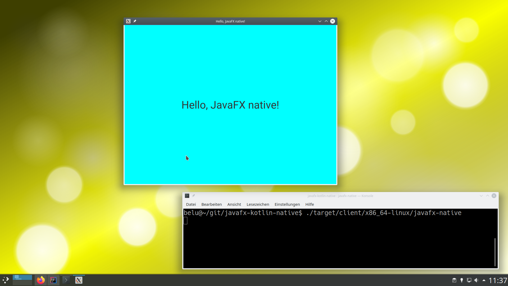

# javafx-kotlin-native

Sample application using [Kotlin](https://kotlinlang.org),
[Maven](https://maven.apache.org),
[JavaFX](https://openjfx.io) and
[Gluon](https://gluonhq.com)
[Client Maven Plugin](https://github.com/gluonhq/client-maven-plugin/)
together with [GraalVM](https://www.graalvm.org)
to build a native executable.

Tested with **Linux x86_64**.

## Requirements

[GraalVM](https://www.graalvm.org) has to be installed locally. See [here](https://docs.gluonhq.com/#platforms_linux) for
instructions.

Furthermore, you have to install some [extra libraries](https://docs.gluonhq.com/#_required_packages).

## Build native application

```shell
mvn clean client:build
```

Should you miss any required libraries, the build will fail. Install the missing libs and try again (they are listed in the
console output).

## Run the native JavaFX application

```shell
./target/client/x86_64-linux/javafx-native
```


